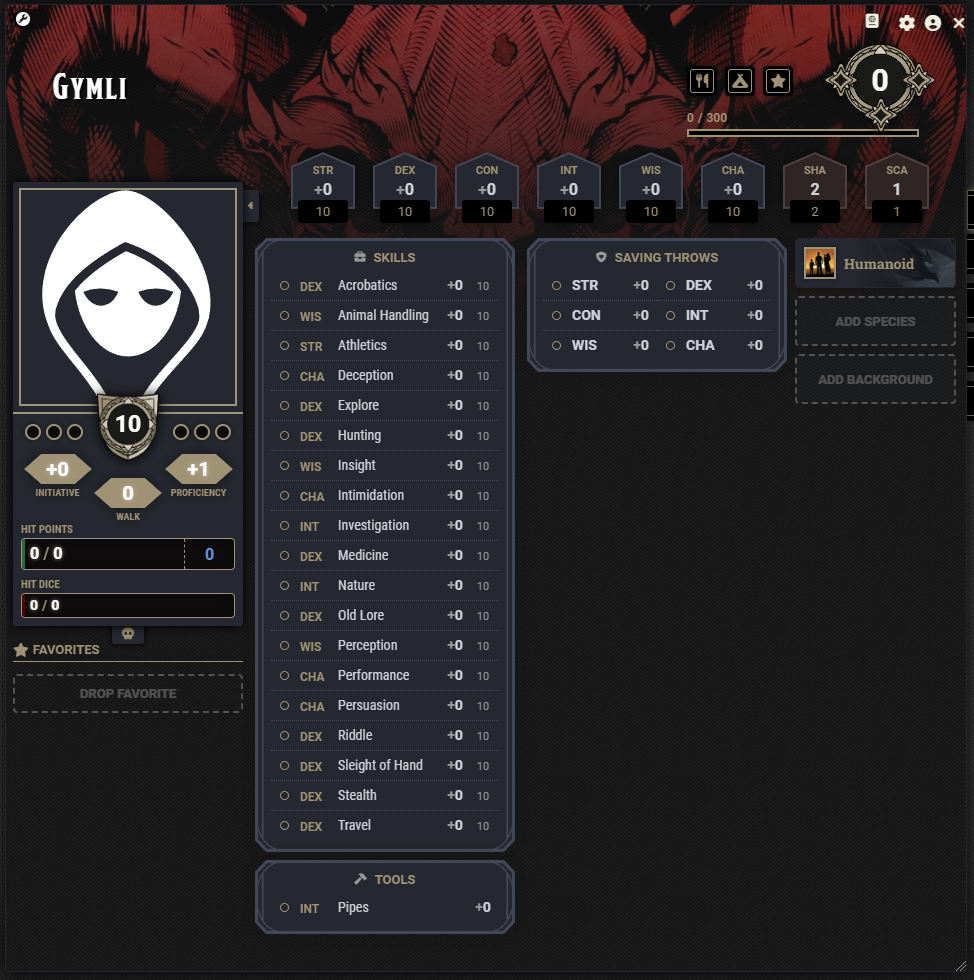
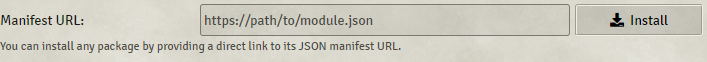

# The Lord of the Rings Roleplaying 5E
The Lord of the Rings Roleplaying 5E is a module for Foundry VTT's DND5E system. It allows players to play DND5E using the rules from Free League's Lord of the Rings system: The Lord of the Rings Roleplaying 5E.


<a href="https://ko-fi.com/dwinther"></a>


## Features
Currently the module overrides the default 5e character sheet with one, more closely resembling the one from LOTR5E.



The module adds 2 new stats: Shadow and Shadow Scars, and adds the skills: Old-Lore, Riddles, Hunting, Travel and Explore, while removing the 5e Arcana and Religion skills from the game.

Languages from LOTR5E also replaces the default 5e languages, as does the currencies and their respectable conversions.

No content (creatures, items, etc.) is included in this module. It aims purely to create a framework for players to use the LOTR5E rules in Foundry VTT.

## Installation
Make sure you have the dnd5e system installed, then copy ```https://github.com/ZWinther/lotr5e-module/releases/latest/download/module.json``` and paste it in the manifest url field in Foundry:



### **Warning**: Actors/worlds made with this module enabled, will most likely break if it's disabled.

Treat it as an "expansion pack" to the DnD5e system. "Save games" made with the expansion enabled won't run without it.

Always backup your world data before enabling :)

## Compatibility

I do my best to keep the module up-to-date with both the latest Foundry version and the latest updates to the 5e system. Sometimes the updates will break something and depending on my work and daily life, it might take a little while to make a fix. Creating an issue [here](https://github.com/ZWinther/lotr5e-module/issues) will keep me informed about what I need to fix.

## Acknowledgements

This module is an upgraded version of my [Adventures in Middle-Earth Module](https://gitlab.com/dwinther/aime-module), which was based on the work of Minas, the creator of the [Foundry 0.7.x version of the module](https://gitlab.com/miketremp/aime-module), who in turn built their module on the work of [Alakar](https://gitlab.com/alakar1/aime-module).

I also would not have been able to make this work without the help from the lovely folks in the League of Extraordinary FoundryVTT Developers Discord.

## License

This module is a fan project, and its author is in no way affiliated with or endorsed by Free League Publishing or Middle-earth Enterprises.
